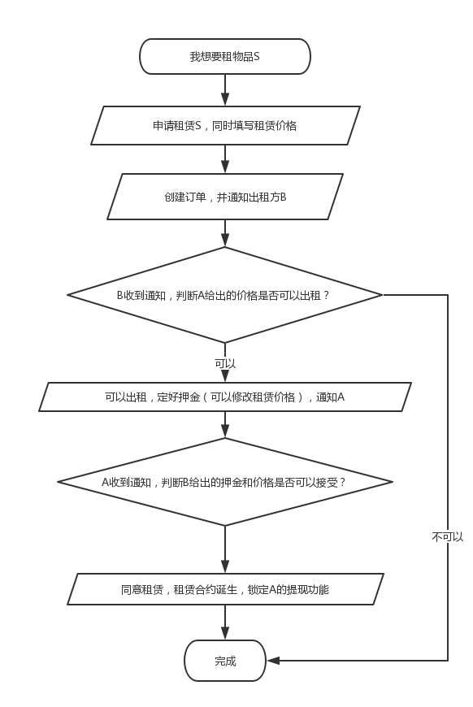
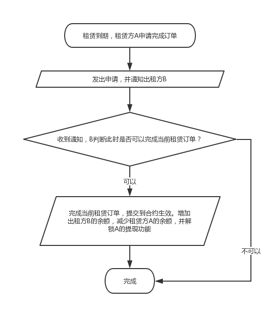

## Seele Rental

基于元一Seele的共享租赁DApp.

## 解决痛点

- 相较于传统的App应用，基于区块链的DApp的服务几乎没有宕机的可能，一年之内能够保持99.99%的服务时间。
- 传统的中心化共享租赁应用平台的押金都是交由平台管理，这存在一定的风险！像中国共享单车行业百家争鸣到百家陨落的时候，共享单车APP的押金难取回一直是个问题！但是基于Selee的共享租聘平台不会出现这种情况，租赁期间的押金都交予合约管理，一经提交无法修改且就算合约创始人也没有权限提取合约存储的押金，从而保证押金的安全。

## 介绍

该DApp应用适合绝大多数共享租赁应用的使用场景。我们在该场景下定义下面几个因素：

- A：租赁方
- B：出租方

租赁订单创建流程如下：

租赁订单完成流程如下：

## 扩展

当前的DApp可以适用绝大多数共享租赁应用。如：共享单车，共享雨伞，共享充电宝等。

## 当前功能

- [x] 完整的会员体系
- [x] 合约余额体现
- [x] 完成的租赁流程
- [x] 消息通知

## FAQ

- [安装教程](docs/install.md)

## License

**MIT**
